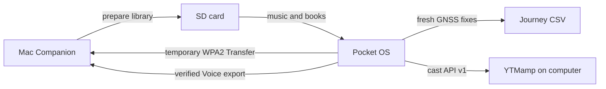

<p align="center"></p>

# Pocket OS / ABVx for M5Stack Cardputer

[](https://github.com/markoblogo/Pocket-OS-Cardputer-ABV/actions/workflows/checks.yml)
[](https://github.com/markoblogo/Pocket-OS-Cardputer-ABV/releases)
[](https://github.com/espressif/esp-idf/tree/release/v5.4)
[](LICENSE)

**Music, books, short voice notes and walking tracks. A pocket device, with a Mac companion.**

A keyboard-first ESP-IDF firmware project for Cardputer. Keep your library on SD,
record a quick thought, and prepare your next walk without turning the device
into another phone.

[Download releases](https://github.com/markoblogo/Pocket-OS-Cardputer-ABV/releases) ·
[Installation](docs/INSTALL.md) · [Mac Companion](docs/COMPANION_DESKTOP.md) ·
[Hardware checklist](docs/SMOKE_TEST.md)

> **Current status:** release candidate. Host tests and firmware compilation pass;
> Voice transfer, GNSS and extended Journey use still require physical-device acceptance.

## What you can do

| Feature | What it provides | Current boundary |
| --- | --- | --- |
| Music | MP3 library with content deduplication and readable indexes | SD required |
| Reader | Prepared TXT books; EPUB/FB2 conversion on Mac | SD required |
| Voice | Short internal recordings; verified, non-destructive export | New firmware and Transfer Wi-Fi required |
| Journey | GNSS tracks, CSV, distance and elapsed time alongside Music | External GNSS; hardware acceptance still pending |
| Inbox and Notes | Local capture and recovery-aware persistence | Keep backups before upgrading |
| Mac Companion | Compact terminal-style desktop UI for files and device tasks | Local macOS installation; not notarized |
| YTMamp remote | Play/pause, previous, next and status over a token-protected local API | Opt-in LAN setup; physical-device acceptance pending |

## How it fits together



Music and books stay on removable storage. Internal Voice recordings move only
through a manually started Transfer session and remain on the device after a
verified export.

## Start here

1. Read the [installation and backup instructions](docs/INSTALL.md). Do not erase
   flash when upgrading a device with recordings or notes.
2. Download [v0.3.0-rc2](https://github.com/markoblogo/Pocket-OS-Cardputer-ABV/releases/tag/v0.3.0-rc2),
   or build from this repository using ESP-IDF **5.4.x**. The firmware project
   is at the repository root.
3. Prepare music and books with [Mac Companion](docs/COMPANION_DESKTOP.md).
4. Use the [smoke checklist](docs/SMOKE_TEST.md) on your own hardware before
   relying on a new build away from home.

```sh
. "$HOME/esp/esp-idf-v5.4.4/export.sh"
idf.py build
```

## Mac app: click, connect, choose an action

```sh
zsh tools/install_companion_app.zsh
```

Open **Applications → ABVx Companion**. The installer bundles the local service,
UI and ABVx icon in a native window. It needs an existing Python 3 interpreter;
firmware build/flash additionally needs the checkout and ESP-IDF. It does not
bundle Python, AI model weights, or an Apple notarization ticket. An existing
installation is not overwritten silently; move it aside before reinstalling.

The everyday screen has **Music**, **Books** and **Voice**, with firmware and
maintenance under Additional actions. No operation starts just because you
connect a device.

### Three connections, different jobs

| Connection | Use |
| --- | --- |
| USB | Firmware programming; not an SD mass-storage connection |
| SD card reader | Music, books and note backup |
| Cardputer Transfer Wi-Fi | Internal Voice export and device time |

For Wi-Fi, open **Transfer** on Cardputer, then join the network shown on its
screen from the Mac. A USB cable alone is insufficient for these HTTP operations.
The Companion does not currently implement a Bluetooth transfer transport.

## Data first

- Music duplicates are identified by file content, not just their titles.
- Sync stages payloads before publishing the new index; old payloads are kept
  hidden for recovery rather than immediately destroyed.
- Internal Voice exports are checked by size and SHA-256. Device originals stay.
- A failed mount of non-empty internal storage does not trigger automatic format.
- Back up before firmware changes. These safeguards are not a guarantee against
  all SD/FAT failures or power loss.

[Data safety](docs/DATA_SAFETY.md) · [Voice export and transcription](docs/VOICE_TO_TEXT.md)

## Optional YTMamp control

Pocket OS can act as a small local remote for [YTMamp](https://github.com/markoblogo/YTMamp). Configure the computer address, port `18880`, and a shared token using the [YTMamp setup guide](docs/YTMAMP.md). The repositories share a machine-readable API contract that CI checks on both sides.

## AI: optional, on the Mac

Local transcription and experimental routing belong on the host. They are not
an autonomous LLM running on Cardputer, and installing Companion does not install
or validate model weights. Read the setup instructions before enabling them.

## Release status

**0.3.0-rc2 is a pre-release**, not a claim of completed hardware acceptance.
Host regression tests and firmware compilation have passed during development;
GNSS reception on the target module, live Voice Wi-Fi export and model-backed
transcription require separate end-to-end acceptance.

[Changelog](CHANGELOG.md) · [Project status](docs/PROJECT_STATUS.md) ·
[Hardware acceptance](docs/HARDWARE_ACCEPTANCE.md) ·
[Roadmap](docs/ROADMAP.md) · [Contributing](CONTRIBUTING.md)

If this is useful, a star helps others discover it. Hardware reports are even
more useful: include your exact board/module, firmware version and reproduction
steps. Do not attach private voice recordings or location tracks to public issues.

## Licensing and dependencies

Project-owned code is available under the [MIT License](LICENSE). Vendored and
optional dependencies retain their own licenses; see the [dependency inventory](docs/DEPENDENCIES.md)
and [third-party notices](docs/THIRD_PARTY_NOTICES.md).

<!-- ABVX:ECOSYSTEM:BEGIN -->
## ABVX ecosystem

- [YTMamp](https://github.com/markoblogo/YTMamp/releases/latest) — Controls YTMamp through the versioned, token-protected cast API and checks the shared contract in CI. Current release: `v0.4.1`.
- [AGENTS.md_generator](https://agentsmd.abvx.xyz/) — Keeps repository guidance and machine-readable context current. Current release: `v0.5.1`.
- [abvx-agent-skills](https://abvx.xyz/work/abvx-agent-skills) — Uses shared, reviewable agent capabilities during maintenance. Current release: `v0.15.0`.

_This block is generated from the reviewed ABVX ecosystem registry._
<!-- ABVX:ECOSYSTEM:END -->
